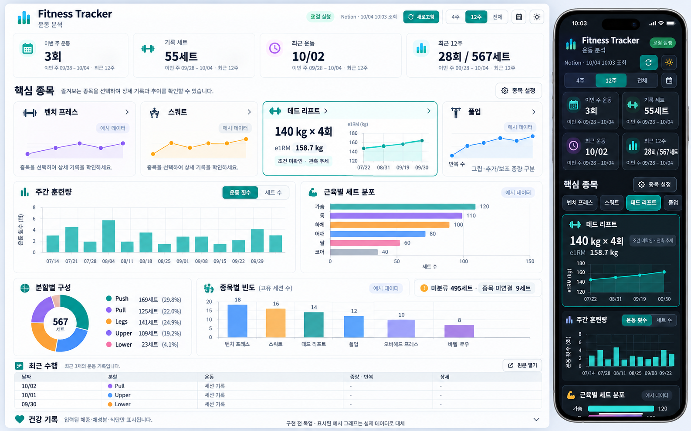
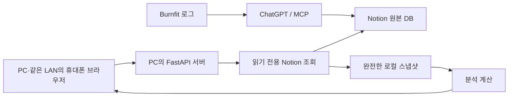

# Fitness Tracker 로컬 웹 대시보드 명세

작성일: 2026-10-04 · 구현 검증: 2026-10-05 · 시간대: Asia/Seoul

소스와 자동 검사를 구현했습니다. [실행 안내](local-dashboard-runbook.md)와 [검증 결과](local-dashboard-validation.md)를 참고하세요. 실제 개인 PC·iPhone의 LAN 확인은 남아 있습니다.

사용자가 채택한 웹 목업을 구현하기 위한 기준 문서다. 이 문서 작성으로 앱 구현이나 Notion 변경을 시작하지 않는다. 기존 Notion 구성의 검증 이력은 [기존 구성 문서](../fitness-tracker-audit-and-plan-2026-10-03.md)에 보존한다.

## 1. 확정한 제품과 운영 방식

운동 후 **Burnfit 로그 → ChatGPT → MCP → Notion**으로 기록한다. 웹은 Notion의 원본을 조회해 운동 성과와 훈련 구성을 한 페이지에 보여준다. PC에서 필요할 때 실행하고, 접속하거나 새로고침할 때 데이터를 가져온다.

| 항목 | 확정 요구사항 |
|---|---|
| 주 용도 | 개인 운동 분석. 기록 과정은 현재 방식 유지 |
| 데이터 | Notion 원본 DB. 웹에서 기록 추가·수정·삭제하지 않음 |
| 첫 페이지 | 주간 요약, 핵심 종목, 훈련량, 분포, 빈도, 최근 수행을 한 페이지에 배치 |
| 핵심 종목 | 기본 벤치 프레스·스쿼트·데드 리프트·풀업. 웹에서 선택·제거·순서 변경 |
| 성과 표시 | 실제 중량·반복 우선, e1RM 보조. 직전 수행, 기록상 최고, 조건 확인 시 PR 비교 |
| 분석 범위 | 기존 C01–C10의 분석 항목 모두 포함. 조건·기준이 없는 지수는 빈 상태로 안내 |
| 기본 기간 | 이번 주 요약 + 최근 12주 분석. 4주·12주·전체·사용자 기간 선택 |
| 디자인 | 채택한 목업의 정보 배치. 시스템 테마, 밝게·어둡게 수동 선택 |
| 기기 | PC Chrome, iPhone Safari 우선. 모바일에서는 같은 페이지를 세로로 읽음 |
| 계정 | 개인용, 별도 로그인 없음 |
| 비용·가동 | 로컬 PC에서 필요할 때 실행. 유료 서버·도메인·상시 가동 불필요 |
| 갱신 | 접속 시 조회, 수동 새로고침. 조회 시각·진행·실패·이전 데이터 표시 |
| 내보내기 | 현재 필터의 CSV, 개별 차트 PNG |
| 저장소 | 기존 저장소에 웹용 디렉터리 추가. 기존 Notion 도구와 원본 유지 |

### 접근 범위

- 기본 주소는 `http://127.0.0.1:8000`. 실행한 PC에서 사용한다.
- 휴대폰은 **PC가 켜져 있고 앱이 실행 중일 때**, 같은 LAN에서 선택적으로 접근한다. `--lan` 실행과 운영체제 방화벽 설정이 필요할 수 있다. 인터넷 전체에 공개하지 않는다.
- PC가 꺼지거나 앱을 종료하면 새 조회를 할 수 없다. 모바일 데이터망에서 원격으로 쓰는 기능은 1차 범위에 없다.
- PWA와 홈 화면 바로가기는 가능한 환경에서 지원한다. iPhone의 LAN HTTP 접속에 서비스 워커 설치나 오프라인 동작을 보장하지 않는다. 일반 Safari 접속으로 핵심 기능을 모두 사용할 수 있어야 한다.

### 범위 밖

웹 기록 입력, Notion 쓰기, 로그인·다중 사용자, 공개 공유, 알림, PDF, 예약 동기화, 유료 호스팅은 1차 구현에 포함하지 않는다. Notion 페이지 안에 HTML 대시보드를 삽입하지 않는다. 이번에 채택한 **독립 로컬 웹**은 이전 네이티브 구성과 별도다.

## 2. 채택한 목업과 화면 기준



목업은 배치·색·정보 계층을 위한 디자인 자료다. 그래프의 궤적과 분포 수치는 예시이며 실제 데이터로 복사하지 않는다. `3회·55세트`, `28회·567세트`, `10/02`, `140kg×4회`도 과거 조회 시점의 값이다. 제품에 상수로 넣지 않는다. 실제 날짜 간격과 계산값을 차트 좌표에 적용한다.

### 화면 순서

1. 제목, 로컬 실행 상태, Notion 조회 시각, 새로고침, 분석 기간, 테마.
2. 이번 주 운동·기록 세트·최근 운동·선택 기간 합계의 요약 4개.
3. 핵심 종목과 종목 설정. 최근 실제 수행, e1RM 또는 풀업 반복, 추세.
4. 주간 훈련량과 근육별 세트 분포.
5. 분할별 구성과 종목별 빈도. 미분류·관계 누락 건수.
6. 종목별 세트 분포와 핵심 종목 상세 분석. 탭이나 접기 영역으로 제공.
7. 최근 운동과 실제 세트 상세. 원본 Notion 열기, CSV.
8. 실제 데이터가 있는 경우에만 접힌 건강 기록 영역.

핵심 요약과 주요 차트는 처음부터 표시한다. 추가 분석은 같은 페이지의 탭·확장 영역에서 읽는다. 설정은 대화상자, 수행 상세는 펼침 또는 사이드 패널로 제공한다.

### PC·모바일 배치

| 요소 | PC: 1,200px 이상 | 태블릿: 768–1,199px | 모바일: 320–767px |
|---|---|---|---|
| 페이지 | 최대 너비 1,440px, 좌우 여백 24px | 좌우 20px | 좌우 16px, 360px 미만은 12px |
| 요약 | 4열 | 2×2 | 2×2, 숫자와 날짜를 줄바꿈 없이 읽기 |
| 핵심 종목 | 4카드, 선택 카드는 약 1.4배 너비 | 2열 카드 | 종목 탭 + 선택 종목 카드 1개 |
| 주요 차트 | 주간 훈련량·근육 분포 2열 | 2열, 제목·범례가 길면 1열 | 1열, 차트 세로 순서 유지 |
| 구성·빈도 | 분할 구성 1 : 빈도 2 너비 | 가용 너비에 맞게 1–2열 | 세로 카드 |
| 최근 수행 | 날짜·분할·종목·중량/반복 표 | 핵심 열만 표시 | 세션 카드, 펼치면 세트 목록 |
| 상세 분석 | 같은 페이지의 탭·확장 영역 | 동일 | 탭을 줄바꿈하거나 영역 안에서만 가로 스크롤 |

기본 핵심 종목 4개가 PC 한 행에 들어간다. 더 선택하면 다음 행으로 배치한다. 선택 종목이 2개 이하이거나 긴 이름이어도 빈 칸을 채우려고 가짜 카드를 만들지 않는다.

본문 14–16px, 카드 제목 16–20px, 요약 수치 24–32px를 기준으로 한다. 모바일 터치 대상은 44px 이상이며 차트는 보통 높이 180–240px, PC 주요 차트는 220–280px다. 큰 숫자 하나로 화면 대부분을 차지하지 않는다. 문구는 `이번 주 운동`, `기록 세트`, `주간 훈련량`, `원본 열기`처럼 짧게 쓴다.

### 테마와 차트 디자인

- `system / light / dark` 3가지. 처음은 시스템 설정을 따르며 수동 선택을 저장한다.
- 목업의 밝은 배경·얇은 테두리·청록 강조색을 기본으로 한다. 어두운 테마는 배경·축·범례·툴팁까지 함께 바꾼다.
- 핵심 종목과 분포의 색은 ID에 대응시켜 기간·정렬 변경 후에도 유지한다. 색 외에도 이름·단위·선 형태로 구분한다.
- 막대는 0부터 시작한다. 수치 축의 상한은 데이터에 맞춘다. 추세 축을 잘라 쓸 때는 눈금이 명확해야 한다.
- 날짜 축은 실제 시간 간격을 사용한다. 누락 수행일을 0이나 이전 값으로 채우지 않는다. 이동 평균·예측·곡선 보간은 기본 화면에 넣지 않는다.
- 모든 차트에 제목, 기간, 단위, 집계 기준, 터치/마우스 툴팁을 제공한다. 핵심 카드의 작은 추세에도 값·날짜를 확인할 수 있어야 한다.
- 모바일 툴팁은 탭으로 열고 닫을 수 있어야 한다. 시리즈 선택·정렬·내보내기는 호버 없이 사용할 수 있어야 한다.
- 관측값이 한 개면 점과 값을 표시하고 선이나 발전율을 생성하지 않는다. 직전 수행이 없으면 `직전 기록 없음`으로 표시한다.
- 키보드로 설정·탭·새로고침·내보내기를 실행하고, 차트별 수치 목록을 읽을 수 있어야 한다. 일반 텍스트 대비는 WCAG AA 기준을 충족한다.

## 3. 기간·필터·요약

모든 날짜 계산은 `Asia/Seoul`을 사용한다. 날짜만 있는 기록은 그 날짜 그대로, 시간대가 있는 타임스탬프는 서울 날짜로 변환한다. 시간대 없는 타임스탬프와 기간형 날짜는 자동 추정하지 않고 입력 점검에 표시한다.

| 범위 | 규칙 |
|---|---|
| 이번 주 | 서울 오늘이 속한 월요일 00:00부터 다음 월요일 00:00 전까지. 미래 수행은 제외 |
| 최근 4주 | 오늘을 포함한 최근 28일: 오늘−27일부터 오늘까지 |
| 최근 12주 | 오늘을 포함한 최근 84일: 오늘−83일부터 오늘까지 |
| 전체 | 날짜가 유효한 최초 완료 수행일부터 오늘까지 |
| 사용자 기간 | 시작·종료 날짜 포함. 시작 ≤ 종료 ≤ 오늘 |

주간 차트는 월요일별 버킷을 쓴다. 이동 84일이 두 주를 부분적으로 포함하면 **13개 주간 버킷**이 생길 수 있다. 처음·마지막 부분 주에는 집계한 날짜 범위를 표시한다. 임의로 12개 막대에 압축하지 않는다. 명시한 기간 안에서 조회가 완료되고 기록이 없는 주는 0, 조회가 실패한 주는 미확인이다.

### 요약 카드

| 카드 | 산식·기간 |
|---|---|
| 이번 주 운동 | 이번 주 유효 날짜의 완료 세션 ID 수. 세트가 없어도 완료 세션이면 포함 |
| 기록 세트 | 이번 주 완료 세션에 속한 완료 세트 ID 수. 미분류·종목 미연결 포함 |
| 최근 운동 | 오늘까지의 가장 최근 완료 세션 날짜. 분석 기간 밖이면 그 사실을 표시 |
| 선택 기간 합계 | 분석 기간의 완료 세션 수와 완료 세트 수. 기본 제목은 `최근 12주` |

처음 두 카드는 분석 기간을 바꿔도 이번 주를 유지한다. 각 카드에 해당 기간을 붙여 오해를 막는다. 네 번째 카드와 분석 차트는 선택 기간에 따라 바뀐다. 마지막 운동 카드에는 연도나 날짜 전체를 툴팁/상세로 제공한다.

### 공통 필터

전체 분석에 기간·분할·세트 유형 필터를 제공한다. `전체 유형`이 기본이며 미분류도 포함한다. 종목 상세에서 종목·조건·중량·반복 구간을 추가 선택한다. 필터가 적용된 영역에는 필터 칩과 해제를 제공한다.

세트 유형·종목 필터가 켜진 경우 세션 기반 지표는 해당 세트를 가진 고유 세션으로 계산한다. 필터가 없는 세션 기반 지표는 완료 세션 원본을 계산한다. 이번 주 요약은 공통 분석 필터와 독립적임을 카드의 기간·안내로 표시한다.

## 4. 원본과 정규화 모델

필수 원본은 Workout Sessions, Exercise Sets, Exercise Library다. DB 제목이나 MD 링크만으로 ID를 추정하지 않는다. 실제 데이터 소스 ID와 속성 ID·타입·완료 상태 값을 읽기 전용으로 확인해 로컬 설정에 매핑한다. 속성 이름 변경에도 ID를 통해 매핑을 유지하고, 속성 삭제·타입 변경은 오류로 알려준다.

| 모델 | 필수/주요 필드 |
|---|---|
| Session | `id`, 원본 URL, `date`, 원본 수행 시각·날짜 정밀도, `split`, `completed`, `last_edited_time` |
| Exercise | `id`, `label`, `primary_muscle`, 원본 URL, `last_edited_time` |
| Set | `id`, `session_ids`, `exercise_ids`, `load`, `reps`, 정규화 `set_type`·원본 유형, `completed`, 원본 URL, `last_edited_time` |
| 측정 조건 | 과거 수행에 기록된 조건 키, 확인 여부, 중량 기준·풀업 방식 등 실제로 확인 가능한 필드 |
| Snapshot | `id`, 조회 시작/성공 시각, 원본 최종 수정 시각, 데이터 소스 지문, 정규화 모델, 진단 |

`load`는 원본 측정 단위가 kg임을 확인한 경우 kg로 처리한다. 한 손 덤벨 중량을 두 배로 만들거나 바벨 무게를 임의로 더하지 않는다. 중량 기준은 측정 조건의 일부다. `reps`는 유한한 양의 정수여야 반복 기반 계산에 포함한다.

세트의 날짜·분할·완료 여부는 세션 관계로 확인한다. 세트와 세션이 모두 완료여야 완료 세트다. 관계가 없거나 여러 개이거나 접근할 수 없으면 하나를 임의 선택하지 않는다. 날짜를 결정할 수 없는 세트는 기간 집계에서 제외하고 입력 점검에 남긴다. 종목만 미연결인 완료 세트는 기간 총합과 `미상` 분포에 포함한다.

### 원본 보존과 데이터 품질

- 같은 레코드 ID는 한 번만 센다. 중복 ID, 끊긴 커서, 미완료 조회는 새 스냅샷 발행을 중단한다.
- 관계의 `has_more`를 끝까지 조회한다. 분석에 필요한 세션·종목 관계만 확장하고 불필요한 역방향 관계를 반복 조회하지 않는다.
- 빈 값은 `null`로 보존한다. 0kg, 반복 수 0, 누락된 중량은 서로 다른 상태다.
- 미분류 세트를 Working으로 바꾸지 않는다. 주 근육이 없으면 `미상`; 보조 근육으로 여러 번 세지 않는다.
- 현재 Exercise Library의 기구·그립 속성을 과거 세트의 조건으로 소급하지 않는다. 라벨로 풀업 후보를 찾더라도 맨몸·추가·보조 중량을 추정하지 않는다.
- 미래 날짜·유효하지 않은 반복·음수 중량·관계 문제는 원본을 유지하고 영향받는 계산에서 제외한다. 수치가 유효하지 않은 세트도 완료 세트 수에는 포함할 수 있다.
- 집계 데이터에는 원본 세트·세션 ID를 남긴다. 툴팁이나 상세에서 원본 Notion을 열 수 있다.
- 입력 점검은 선택 기간 내 미분류·종목 미연결·조건 미확인·수치 이상 건수를 표시한다. 날짜를 알 수 없는 제외 건수는 `전체 원본 점검`으로 따로 표시한다.

## 5. 분석 계산 규칙

### 관측값과 비교 가능한 수행

실제 중량·반복은 조건 확인 여부와 관계없이 보여준다. 유효 중량·반복으로 계산한 e1RM은 조건 미확인 상태에서도 **계산 관측값**으로 표시할 수 있다. 이 경우 `조건 미확인 · 관측 추세`를 붙인다.

검증된 비교는 동일 종목 ID, 과거 확인된 측정 조건, 중량 단위·기준, 수행 방식, 동일한 세트 필터를 만족해야 한다. 조건 없는 기록과 조건이 다른 기록을 묶어 발전율이나 검증 PR을 만들지 않는다. 기존 Notion 계산의 엄격한 비교 조건을 완화하지 말고, 웹의 관측용 e1RM과 검증용 지표를 별도 필드로 구현한다.

### 공통 산식

| 지표 | 정의 |
|---|---|
| 완료 세트 수 | 기간 내 완료 세트 ID의 수. 유형 전체가 기본 |
| 운동 횟수 | 해당 조건의 완료 Session ID의 고유 개수 |
| 종목 빈도 | 해당 종목이 수행된 고유 `(Session ID, Exercise ID)` 개수 |
| e1RM 관측값 | 비풀업 종목, 확인된 kg 단위, 중량 > 0, 반복 1–12회에 `중량 × (1 + 반복/30)` 적용 |
| 외부중량 볼륨 | 외부중량 의미가 확인된 비풀업 세트의 `중량(kg) × 반복` 합. 단위 `kg·회` |
| 날짜별 대표값 | 동일 종목·동일 시리즈 조건의 해당 날짜 최고 지표. 동률이면 세션 시각, 세트 ID로 결정 |
| 발전 지수 | 확인된 동일 조건의 날짜별 최고값 ÷ 유효한 고정 기준값 × 100 |

반올림은 표시할 때만 한다. e1RM은 소수 1자리, 볼륨·지수는 필요한 자리만 표시하며 툴팁·CSV에는 원값을 보존한다. 예를 들어 140kg×4회의 e1RM은 158.666…kg이고 표시값은 158.7kg다. e1RM을 실제 1RM으로 표기하지 않는다.

외부중량 볼륨은 수행량 참고 지표다. kg·회를 기계적 일량이나 서로 다른 종목의 근력으로 해석하지 않는다. 맨몸·풀업·단위 미확인·중량 의미 미확인 세트는 제외하며 포함/제외 건수와 측정 기준을 함께 표시한다.

### 핵심 종목 카드와 직전·최고 기록

- 선택 기간에서 가장 최근 완료 세션의 해당 종목을 찾는다. 중량 종목의 대표 세트는 유효 e1RM이 가장 큰 세트로 정하며, e1RM을 계산할 수 없으면 실제 세트 목록을 보여주고 임의 대표 숫자를 만들지 않는다.
- 카드의 큰 값은 `140kg × 4회` 같은 실제 수행이다. e1RM은 그 아래 보조값이다. 원본 날짜·조건·유형을 상세로 확인한다.
- 직전 수행은 선택된 세션보다 이전의 해당 종목 세션이다. 같은 날 별도 세션이면 원본 시각이 확인될 때만 앞뒤 순서를 정한다. 시각 없이 같은 날짜이면 동률로 표시한다.
- 최근 세트와 직전 세트의 실제 중량·반복을 나란히 보여준다. 동일 확인 조건일 때만 변화량·발전율을 표시한다.
- `기록상 최고`는 해당 범위에서 관측된 최대 지표다. 조건 미확인이면 그 문구를 함께 표시한다. `조건 확인 PR`은 동일 확인 조건의 전체 과거 기록을 대상으로 한다.
- 최고 중량과 최고 반복은 동일한 기록일 수 없다. 서로 다른 세트의 중량·반복을 합쳐 하나의 수행처럼 표시하지 않는다.
- 종목 선택은 Exercise ID로 저장한다. 같은 이름의 기구·그립 변형을 자동 합치지 않는다. 기본 4종목은 기존 사전에서 정확한 대응을 찾고, 중복·모호한 경우 설정에서 선택하게 한다.

### C01–C10 차트 정의

| ID | 차트·조작 | 계산·누락 처리 |
|---|---|---|
| C01 | 핵심 종목 근력 추세. 선/점, 종목·조건 선택 | 날짜별 최고 e1RM. 확인 조건별 시리즈 분리. 미확인은 관측 시리즈로 분리하고 확인 시리즈와 연결하지 않음 |
| C02 | 같은 중량의 반복. 중량 선택, 선/점 | 같은 종목·중량·조건의 날짜별 최고 반복. 실제 존재하는 중량만 선택. 풀업은 방식·원본 입력 중량별로도 분리. 미확인 시리즈는 관측으로 표시 |
| C03 | 반복 구간별 최고 중량. 월별 그룹 막대 | 1–5/6–8/9–12회별 최대 중량. 종목·조건 분리, 없는 구간은 `기록 없음`; 0kg 막대 생성 금지 |
| C04 | 주간 훈련량. 운동 횟수/세트 수/외부중량 볼륨 전환 | 월요일 버킷. 세션 수는 고유 ID, 세트 수는 유형별 누적 막대, 볼륨은 유효 세트만. 서로 다른 단위는 한 축에 섞지 않음 |
| C05 | 근육별 세트 분포. 가로 막대 | 주 근육 1개에 배정. `미상` 포함, 개수 내림차순. 모든 막대 합=해당 필터의 완료 세트 수 |
| C06 | 종목별 세트 분포. 전체/상위 10 | 종목 ID별 완료 세트 수. 상위 10은 현재 기간·필터로 다시 산정, 동률은 ID 순. `기타`·`미연결`을 별도 표시 |
| C07 | 종목별 빈도. 가로 또는 세로 막대 | 고유 Session×Exercise 수. 한 세션의 5세트도 1회. 현재 필터의 상위 10, 전체 목록 가능 |
| C08 | 풀업 추세. 방식·조건별 탭 | 날짜별 최고 반복. 맨몸/추가/보조/방식 미확인 분리. 추가·보조 중량은 별도 범례·필터로 확인 |
| C09 | 분할별 구성. 도넛 + 개수/비율 목록 | 세션 수/세트 수 선택에 따라 분모·단위·중앙 합계를 변경. 미상 포함. 반올림 비율 합의 오차 허용 |
| C10 | 발전 지수. 확인 조건만 | 기준 세트·원값·버전을 고정. 중량 종목 e1RM, 맨몸 풀업은 동일 조건 반복. 유효 기준이 없으면 설명과 설정 경로 표시 |

C01·C02·C03·C08·C10은 핵심 종목 상세에서 탭으로 제공한다. C04·C05·C07·C09는 기본 분석 영역에 펼쳐 놓고 C06은 같은 페이지에서 확장한다. 종목을 선택하면 관련 차트와 실제 기록을 함께 볼 수 있다.

상위 10 차트에서 `기타`는 10위 밖의 연결 종목만 포함한다. `미연결`을 상위 종목으로 순위에 넣지 않는다. 분포에 미연결을 숨기는 경우에는 제외 수와 분모를 표시해야 한다. 범례를 눌러 숨긴 시리즈가 있으면 그 상태를 표시한다.

### 풀업

풀업에 e1RM을 적용하지 않는다. 맨몸 여부는 과거 수행의 명시적 기록으로 확인한다. 입력 중량이 0 또는 비어 있다는 이유만으로 맨몸으로 확정하지 않는다.

| 방식 | 표시·비교 |
|---|---|
| 맨몸 | 같은 그립·수행 조건의 최고 반복. 몸무게 기록 없으면 총 중량 계산 없음 |
| 추가 중량 | `+중량 × 반복`. 같은 추가 중량·조건에서 반복 비교 |
| 보조 중량 | `보조 중량 × 반복`. 같은 보조 중량·기구·조건에서 반복 비교. 보조 감소는 별도 사실로 표시 |
| 미확인 | 실제 반복과 원본 입력 중량을 관측값으로 표시. 검증 발전·다른 방식과 합산 없음 |

현재 사전의 이름이나 최근 체중을 과거 수행에 적용하지 않는다. 풀업 대표값은 선택된 동일 방식·조건 내 최고 반복이며, 추가/보조 중량이 다른 세트를 하나의 최고 반복 추세로 묶지 않는다. 방식이 미확인인 기록은 그 사실을 유지한 별도 관측 시리즈로 표시한다.

### 발전 지수 기준

웹 설정에서 기존에 확인된 기준을 선택하거나 로컬 기준을 저장할 수 있다. 저장 항목은 종목 ID·조건 키·지표·기준 원본 세트 ID·반올림 전 값·버전이다. Notion에 쓰지 않는다.

기준 세트는 해당 날짜·동일 조건의 유효 최고값이어야 한다. 기준 선택 시 원본 세트·세션의 날짜·유형·조건·값·최종 수정 시각을 포함한 `baseline_fingerprint`를 `source_fingerprint`로 저장한다. 원본 수정·삭제, 조건 변경, 기준값·지문 불일치, 버전·지문 누락 시 지수를 무효화하고 기준 재선택을 안내한다. 기간 필터를 바꿔도 기준을 자동 이동하지 않는다. 기준 없는 상태에 예시 지수를 넣지 않는다.

## 6. 최근 수행·건강·설정

### 최근 수행

선택 기간의 최근 완료 세션 3개를 기본 표시하고 `더 보기`로 확장한다. 날짜·분할·대표 종목과 실제 중량/반복을 보여준다. 세션이 여러 종목이면 종목별 줄로 펼쳐 읽으며 대표 세트의 기준을 표시한다. 원본 링크, 세트 유형·조건·중량·반복·e1RM·제외 사유를 상세에서 확인한다.

날짜만 있고 시각이 없는 동일 날짜 세션은 ID로 안정 정렬하되 앞뒤 수행이라고 주장하지 않는다. 최근 수행도 분석 기간·필터를 따른다. 기간 밖의 최근 운동은 요약 카드에서만 확인한다.

### 건강 기록

Daily Health Log, Body Composition, Weekly Reviews, Plans & Targets는 선택 원본이다. 연결된 실제 기록이 있는 경우에만 관련 영역을 제공한다. 체중·체성분은 항목별 실제 관측일·값·단위를 표시하고 결측을 보간하지 않는다. 식단은 기록된 필드만 표시한다. 운동 성과와의 원인 관계·의학적 해석은 만들지 않는다.

선택 원본 미설정은 정상 상태다. 설정한 선택 원본의 조회 실패는 해당 영역의 마지막 성공 시각·오류를 표시하며 필수 운동 스냅샷 성공 여부와 구분한다. 오래된 목표는 종료일을 확인하고 현재 목표로 자동 적용하지 않는다. 사용 중인 원본·참조 관계는 이 작업에서 삭제하지 않는다.

### 개인 설정

핵심 종목 검색·추가·제거·순서, 선택 종목, 테마, 기본 분석 기간, 로컬 발전 기준을 저장한다. 브라우저 `localStorage`를 사용하며 서버 토큰이나 전체 원본은 넣지 않는다. 저장 형식에 버전을 둔다. 종목이 삭제·접근 불가가 되면 그 항목을 표시하고 대체 선택을 안내한다.

PC·휴대폰·다른 브라우저 사이에 설정이 자동 동기화되지는 않는다. CSV 내보내기와 설정 저장은 Notion 쓰기가 아니다. 연결 정보는 브라우저 설정 화면에 토큰 입력란을 만들지 않고 로컬 서버 설정으로 관리한다.

## 7. 조회·갱신 상태

처음 접속하면 캐시를 먼저 보여줄 수 있으나 즉시 신규 조회를 요청한다. 수동 새로고침도 캐시만 반환하지 않고 Notion을 다시 읽는다. 앱을 계속 열어 두었을 때 자동 폴링은 하지 않는다. 서울 날짜가 바뀌거나 탭으로 돌아오면 마지막 조회 날짜를 확인해 갱신 필요를 표시한다.

| 상태 | 화면 동작 |
|---|---|
| 첫 조회 중, 캐시 없음 | 요약·차트 크기에 맞춘 스켈레톤, `Notion 조회 중` |
| 갱신 중, 캐시 있음 | 마지막 성공 데이터 유지, `이전 조회 · 갱신 중`, 시작 시각/진행 표시 |
| 성공 | 전체 필수 원본의 완전한 스냅샷을 함께 교체. `Notion · MM/DD HH:mm 조회` |
| 실패, 캐시 있음 | 이전 데이터 유지, `갱신 실패 · 마지막 성공 …`, 재시도 버튼. 성공 시각 변경 금지 |
| 실패, 캐시 없음 | 분석 숫자를 생성하지 않고 연결·권한·통신 오류와 재시도 표시 |
| 성공, 해당 기록 없음 | `이 기간에 기록 없음`. 성공 확인된 합계는 0, 계산 불가 지표는 `—` |

`조회 시각`은 이번에 전체 조회가 완료된 시각이다. 원본의 마지막 수정 시각과 다르며 최신성을 영구 보장하지 않는다. 세부 상태에서 조회 시작·완료 시각, 원본 최종 수정 시각, 조회한 DB와 제외 건수를 확인한다.

### 일관된 스냅샷

1. 필수 DB 스키마와 설정을 검증한다.
2. 필수 원본을 끝까지 페이지 조회하고 필요한 관계를 해소한다.
3. ID·`last_edited_time` 지문을 재조회해 첫 조회와 대조한다. 중간 변경 시 다시 조회하며 최대 2번의 전체 시도 후 실패 상태로 종료한다.
4. 정규화·검증·집계를 완료한 데이터만 새 스냅샷으로 원자적으로 교체한다. 레코드가 삭제·휴지통 이동된 경우 성공한 전체 조회에서만 제외한다.
5. 선택 건강 원본은 별도 성공 시각으로 관리한다. 운동 데이터와 다른 시점임을 숨기지 않는다.

Notion API는 여러 DB의 트랜잭션 스냅샷을 제공하지 않는다. 지문 재확인은 조회 도중 확인 가능한 변경을 감지하는 방법이며 전역 원자성을 보장한다고 설명하지 않는다.

동시 접속·버튼 연타는 필수 조회 작업 1개로 합친다. Notion 요청은 서버 전체에서 보수적으로 초당 2회 이하로 제한하고 429의 `Retry-After`, 일시적 5xx·통신 실패를 제한 횟수로 재시도한다. 조회 작업의 전체 제한 시간은 기본 120초다. 시간이 지나면 오류를 표시하고 이전 스냅샷을 유지한다. 각 요청의 무제한 재시도로 전체 제한을 넘기지 않는다.

오류 로그에 토큰·Authorization·원본 전체를 출력하지 않는다. 사용자 문구는 `Notion 접근 권한을 확인하세요`, `원본 속성이 변경되었습니다`, `조회 중 기록이 변경되어 다시 읽습니다`처럼 조치가 드러나게 쓴다.

## 8. 기술 구조와 Python의 역할

Python 3.12+의 **FastAPI + Uvicorn**, **React + TypeScript + Vite**, **Recharts**를 사용한다. 구현 시 지원되는 Node.js LTS를 정하고 Python·npm 의존성 버전을 잠근다. 배포 서비스·유료 차트 라이브러리·클라우드 DB를 추가하지 않는다.



개발 중에는 Vite 개발 서버가 로컬 API를 프록시한다. 일반 사용은 빌드된 정적 웹 파일과 API를 **FastAPI 한 프로세스, 같은 주소**에서 제공한다. 일상 실행에 Node 개발 서버나 두 개의 터미널이 필요하지 않게 한다.

### 모듈 책임

| 모듈 | 역할 |
|---|---|
| 기존 `notion/api.py` | 공식 API, 페이지 조회, 재시도·오류 정리. 읽기 전용 어댑터를 통해 재사용 |
| 기존 `notion/source.py` | 명시적인 필드 매핑·관계 검증 규칙 참고. 웹 설정을 검증하는 별도 진입점 제공 |
| 기존 `notion/metrics.py` | 날짜·주간·고유 빈도·엄격 비교의 순수 계산 재사용. 기존 동작과 회귀 검사 보존 |
| 새 Python 백엔드 | 스냅샷 갱신, 관측용 지표, 분석 응답, 로컬 캐시, 정적 웹 제공 |
| 새 React 웹 | 배치·차트·필터·테마·종목 설정·수치 상세·내보내기 |
| 기존 `prepare`·`apply`·`deploy` | 기존 Notion 페이지 관리. 웹 시작·조회에서는 실행하지 않음 |

기존 Python은 Notion 속성·보기·주간 집계를 관리하며 실제 화면은 Notion이 그린다. 새 Python은 웹을 위한 **데이터 조회·집계 서버**가 되고, 브라우저의 React가 화면을 그린다. 웹은 `NFT …` 표시 수식·네이티브 차트·`apply`로 만든 주간 표가 갱신되기를 기다리지 않고 원본으로 다시 계산한다. 확인 조건·기준 같은 명시적 원본 입력은 읽을 수 있다.

### 예정 디렉터리

```text
dashboard/                     # 신규 Python 읽기 전용 웹 백엔드
  __main__.py                  # 일반 실행 / --lan
  server.py                    # API·정적 파일
  reader.py                    # Notion 읽기 전용 어댑터·필드 매핑
  snapshots.py                 # 조회 작업·지문 검증·원자적 캐시
  analytics.py                 # 웹 분석·관측/검증 구분
  models.py                    # 요청·응답 스키마
web/
  src/                         # React·TypeScript·차트·테마
  package.json
  package-lock.json
  dist/                        # 빌드 산출물, Git 제외
tests/                         # 기존 Python 검사 유지
tests/test_dashboard/          # 신규 분석·API 검사
web/tests/                     # 컴포넌트·브라우저 검사
docs/
  local-web-dashboard-spec.md
  assets/local-dashboard-mockup.png
.local/
  dashboard-config.json        # 실제 ID·속성 매핑, Git 제외
  dashboard-cache.json         # 마지막 성공 스냅샷, Git 제외
```

디렉터리와 명령은 **구현할 인터페이스**이며 현재 저장소에 웹 앱이나 실행 명령이 존재한다는 뜻이 아니다. 빌드·의존성 설치·실행을 README에 구분해 문서화한다. 일반 실행의 목표 인터페이스는 `python -m dashboard`, LAN 선택 실행은 `python -m dashboard --lan`이다. 기본 포트 8000을 변경할 수 있게 하고 사용 중이면 다른 주소를 조용히 택하지 말고 해결 방법을 안내한다.

새 로컬 설정은 필수 3개 데이터 소스, 속성 ID·타입, 완료 값, kg 단위의 확인, 풀업 종목 ID, 선택 건강 원본을 담는다. 기존 `.local/notion-config.json`에서 검증된 매핑을 가져올 수 있으나 해당 파일을 덮어쓰지 않는다. 웹 사용에 `parent_page_id`, Notion 관리 페이지, `prepare` 실행을 요구하지 않는다.

### 캐시와 실행 비용

마지막 성공 정규화 스냅샷을 로컬 JSON으로 저장한다. 임시 파일 작성 후 교체해 중간 파일을 정상 캐시로 읽지 않는다. 캐시 형식·계산 버전에 따라 무효화할 수 있어야 한다. 서버 재시작 후 이전 데이터를 보여줄 수 있지만 반드시 새 조회를 수행하며 성공 시각을 유지한다.

캐시·원본·설정·토큰은 Git 제외다. 저장된 스냅샷은 개인 PC에만 두며 추가 서버 비용이 없다. Notion 조회에는 인터넷과 원본 접근 권한이 필요하다. 클라우드 환경의 secret이 개인 PC로 자동 복사되지는 않으므로 첫 로컬 설정에서 `NOTION_TOKEN`을 서버 환경에 안전하게 제공한다. 연결 누락 시 설정 방법을 안내하고 예시 데이터를 실데이터처럼 표시하지 않는다.

## 9. API 계약

API는 `/api` 아래에 두고 같은 서버에서만 호출한다. Notion 토큰·내부 설정 파일·프록시 자격 증명은 응답에 포함하지 않는다. 클라이언트에 필요한 원본 ID·링크·집계·진단만 반환한다.

| 경로 | 요청·응답 |
|---|---|
| `GET /healthz` | 프로세스 준비 상태. Notion을 매번 호출하지 않음 |
| `GET /api/status` | 마지막 성공 스냅샷, 현재 조회 작업, 연결 상태·필수/선택 원본 상태 |
| `POST /api/refresh` | 실제 Notion 신규 조회 시작. `202`와 작업 ID. 진행 중 작업이 있으면 같은 ID 반환 |
| `GET /api/refresh/{job_id}` | `queued / running / succeeded / failed`, 진행·오류·새 스냅샷 ID |
| `GET /api/catalog` | 현재 스냅샷의 종목 ID·라벨·주 근육·가능한 조건·유형. 스냅샷 ID 포함 |
| `POST /api/analysis` | 스냅샷 ID, 기간·분할·유형·종목·조건 필터, 핵심 종목 ID, 로컬 기준 → 요약·C01–C10·최근 수행·진단 |
| `GET /api/sessions/{id}?snapshot_id=…` | 해당 스냅샷의 세션·실제 세트·원본 링크. 접근 불가면 오류 |
| `POST /api/export/csv` | 분석 요청과 동일한 필터, 내보낼 세트/세션 종류 → UTF-8 CSV |

`POST /api/analysis`와 내보내기는 로컬 스냅샷을 계산하는 요청이며 Notion 수정이 아니다. 기간·종목 설정을 바꾸는 것만으로 Notion 전체 조회를 반복하지 않는다. 요청의 ID·날짜·숫자·선택 수·본문 크기를 검증한다.

### 분석 요청·응답의 필수 필드

```text
AnalysisRequest
  snapshot_id: string
  range: { preset: 4w | 12w | all | custom, start?: ISO-date, end?: ISO-date }
  filters: { split_ids_or_values: string[], set_types: string[], exercise_ids: string[] }
  core_exercise_ids: string[]
  detail_scope: { exercise_id?, condition_key?, fixed_load?, pullup_mode? }
  baselines: [{ exercise_id, condition_key, metric, source_set_id, source_fingerprint, value, version }]
  recent_limit?: integer 1–1000, 기본 3

AnalysisResponse
  meta: { snapshot_id, schema_version, timezone, range_start, range_end,
          fetched_at, source_max_last_edited_at, refresh_state, using_previous_data }
  summary: { current_week_start, current_week_end, sessions, sets,
             latest_completed_session_date, range_sessions, range_sets }
  core_exercises: [실제 대표 세트, 직전 수행, 관측 e1RM, 조건·최고 기록·제외 사유]
  charts: { C01 ... C10 }
  recent_sessions: [실제 세션·세트 상세 연결]
  recent_total: 선택 기간·필터의 전체 세션 수
  diagnostics: { 각 문제의 건수, 제외 범위, 원본 ID }
  optional_sources: { health ... 각 원본의 상태·마지막 성공 시각 }

ChartResult
  status: ok | empty | unavailable
  metric, unit, aggregation, range, denominator?
  series: [{ key, label, observation_only, condition_key?, points: [...] }]
  points: { date_or_bucket?, category_id?, value: number | null,
            sample_count, source_set_ids, source_session_ids, detail? }
  exclusions: { count, reasons }
```

계산할 수 없는 값은 `null`과 사유로 반환한다. `0`은 성공한 조회에서 실제 합계가 0인 경우에만 사용한다. 클라이언트는 빈 배열을 무조건 0 그래프로 바꾸지 않는다.

여러 영역의 응답은 같은 스냅샷 ID로 묶는다. 새 스냅샷으로 바뀌는 동안 이전 분석 응답을 섞지 않는다. 요청한 스냅샷을 더 이상 보유하지 않으면 `409`로 최신 ID를 알려주고 전체 분석을 다시 요청한다. `400`은 잘못된 필터, `422`는 요청 필드 검증 오류, `404`는 없는 세션/작업, `503`은 사용 가능한 필수 스냅샷 없음으로 구분한다.

## 10. 로컬 노출·내보내기

별도 로그인은 만들지 않는다. 대신 기본 바인딩은 loopback이며 LAN 공개는 명시적으로 선택한다. LAN 모드는 같은 네트워크의 개인 기기에서 사용하는 범위다. 신뢰할 수 없는 공유 네트워크나 인터넷 공개용 서비스로 안내하지 않는다.

- Notion 읽기 어댑터는 조회용 GET과 데이터 소스 query용 POST만 허용한다. 페이지/속성 생성·수정·삭제 및 `prepare`·`apply`·`live-check`·`watch`를 웹 경로에서 호출할 수 없게 한다.
- 기존 통합 토큰의 권한이 넓어도 웹은 읽기만 한다. 새 통합을 만드는 경우 필요한 원본의 읽기 권한만 요청한다.
- 서버는 허용 Host/Origin을 검사하고 임의 Origin의 CORS를 열지 않는다. LAN 모드도 지정한 로컬 주소만 허용한다.
- 브라우저에서 입력한 외부 URL을 서버가 대신 조회하는 기능은 만들지 않는다. 원본 링크는 검증된 Notion URL로 연다.
- 개인 API 응답은 `Cache-Control: no-store`; 서비스 워커에는 정적 앱 파일만 캐시한다. 캐시된 데이터와 성공 조회 상태를 혼동하지 않는다.

CSV는 현재 선택 기간·필터의 실제 세트 또는 세션을 내보낸다. 날짜, 종목, 유형, 원본 중량·반복, 관측 e1RM, 조건 확인 여부, 원본 ID·URL을 포함하고 적용된 기간·스냅샷 시각을 함께 제공한다. 한글을 일반 스프레드시트에서 읽을 수 있게 UTF-8 BOM, 쉼표·줄바꿈 인용, 텍스트 수식 실행 방지를 적용한다. 숫자 필드는 실제 숫자값을 유지한다.

PNG는 개별 차트의 제목·기간·단위·범례·조회 시각을 포함한다. 웹 폰트 로딩과 테마 색을 적용한 SVG를 캔버스로 변환하고 2배 해상도로 저장한다. 외부 이미지 때문에 내보내기가 실패하지 않게 차트 자산을 로컬에서 제공한다. 전체 페이지 PDF나 공개 이미지 업로드는 만들지 않는다.

## 11. 검증과 완료 조건

목업을 닮은 결과를 판단하려면 **실제 브라우저 렌더링**을 검사해야 한다. API 응답·차트 설정만 통과한 것을 화면 구현 완료로 보고하지 않는다. 디자인 예시 데이터와 실제 Notion 데이터의 검증을 분리한다.

### 분석·갱신 검사

| 검사 | 통과 기준 |
|---|---|
| 같은 세션 5세트 | 세트 5, 운동 1, 해당 종목 빈도 1 |
| 날짜·주간 경계 | 서울 일요일·월요일, UTC 자정 전후에서 요약과 주간 차트 일치. Notion `this_week` 필터에 의존하지 않음 |
| 4주·12주·부분 주 | 경계 날짜 포함 여부·주간 합계 일치. 부분 주와 13버킷 경우 확인 |
| 세트 유형 | Working·Top Set·Warm-up·기타 원본 유형·미분류가 보존되고 유형 합=전체 세트 |
| 분포 | 근육·종목·분할의 합과 해당 분모 일치. 미상·미연결 포함/제외가 명시됨 |
| e1RM | 140×4 → 원값 158.666… / 표시 158.7. 반복 13·소수·누락·0/음수 중량·풀업은 대상 제외 |
| 조건 미확인 | 관측 차트는 표시, 검증 발전율·PR은 생성하지 않음. 확인 조건 시리즈와 분리 |
| 풀업 | 맨몸·추가·보조·미확인이 분리됨. 0/빈 중량의 자동 맨몸 확정이나 체중 추정 없음 |
| 기준 | 기준=100. 원본 변경·삭제·조건/값/버전 불일치 시 무효화. 기간 변경으로 기준 이동 없음 |
| 상위 10 | 기간·필터 변경 및 동률에서 안정적으로 재산정. 빈도와 세트 수의 순위가 혼동되지 않음 |
| 조회 완전성 | 100행 초과·관계 `has_more` 끝까지 조회. 중간 실패·지문 변경 시 새 캐시 발행 금지 |
| 기록 변경 | 추가·수정·삭제/휴지통·복구가 다음 성공 새로고침에서 반영. 오래된 파생 행을 읽지 않음 |
| 실패·재시작 | 이전 성공값·시각 유지. 첫 조회 실패는 0으로 보이지 않음. 재시작 캐시도 신규 조회 수행 |
| 동시 갱신 | 접속·버튼 연타가 한 조회 작업으로 합쳐지고 전역 요청 속도·전체 제한 시간을 지킴 |
| 읽기 전용 | 웹의 모든 흐름에서 Notion 생성/수정/삭제 요청 0건. 원본 입력값·기존 설정 보존 |

가짜 전송기와 합성 스냅샷으로 분석·오류·수정/삭제/복구 사례를 검사한다. 브라우저 검사는 고정 시각·데이터로 반복 가능하게 한다. 실계정에서는 읽기 전용 대조만 수행하고 검사를 위해 실제 운동 기록을 수정하지 않는다.

### 화면·사용성 검사

- PC Chrome 1440×900·1920×1080, 모바일 Safari 계열 390×844·430×932, 작은 너비 320px, 태블릿 768px를 검사한다. Playwright WebKit 검사는 실제 iPhone 확인과 구분한다.
- PC 1440×900의 처음 화면에 제목·갱신·필터·요약 4개·핵심 종목·주간 훈련량·근육 분포가 보여야 한다. 아래 분석과 실제 기록은 같은 페이지에서 이어진다.
- 모바일 390×844의 처음 화면에 갱신 상태·기간·요약 4개·핵심 종목 선택·선택 카드가 보여야 한다. 차트와 최근 기록은 세로로 이어지고 페이지 전체의 가로 스크롤은 없어야 한다.
- 실제 Notion 데이터에서 긴 한글 종목·같은 이름의 변형·빈 기간·조건 없는 기록을 확인한다. 표 잘림·축 겹침·범례 잘림·큰 공백·깨진 툴팁이 없어야 한다.
- 밝게·어둡게·시스템 변경, 모바일 탭·터치 툴팁, 키보드 조작, 종목 재정렬·삭제, 새로고침 진행·실패 문구를 확인한다.
- CSV의 현재 필터·한글·원값·수식 실행 방지, PNG의 축·범례·테마·조회 시각을 확인한다.
- 같은 LAN의 실제 iPhone에서 접속·필터·새로고침을 확인한다. PC 종료 시 접근할 수 없다는 운영 조건을 문서에 표시한다.
- 채택한 목업과 밝은 PC/어두운 모바일 스크린샷을 나란히 비교한다. 정보 계층·카드 밀도·배치가 다르면 이유와 화면을 제시하고 완료 판정을 유보한다.

### 성능 목표

목표 데이터 규모는 우선 현재의 수백 세트와 수십 세션이다. 캐시가 있으면 요약·주요 화면을 1초 이내에 보여주고, 기간·필터 변경은 새 Notion 조회 없이 300ms 안에 반응하는 것을 목표로 측정한다. 초기 Notion 전체 조회는 수 초에서 수십 초가 걸릴 수 있다. 네트워크·페이지 수·관계·재검증·429에 따라 달라지므로 고정 1초 갱신을 약속하지 않는다.

진행·실패 상태는 조회 완료를 기다리지 않고 즉시 보여준다. 원본 전체와 불필요한 관계를 브라우저로 보내지 않는다. 구현 완료 보고에 캐시 표시, 필터 반응, 실제 전체 조회 시간을 각각 기록한다.

### 기존 검증의 범위

2026-10-04의 기존 원본 확인은 28세션·567세트·67종목, 네이티브 구성은 16차트·4테이블·홈 목록 2개다. Python 검사 56개와 실제 수식·필터 검증은 **기존 Notion 구현의 결과**다. 새 웹의 검증 결과로 인용하지 않는다. 새 웹을 만든 뒤 최신 원본을 다시 조회하고 숫자를 대조한다.

## 12. 구현 순서와 인수 결과물

1. **읽기 계층·스냅샷:** 검증한 원본 매핑, 읽기 전용 어댑터, 날짜·관계·캐시·조회 상태. 원본을 수정하지 않음을 검사한다.
2. **핵심 화면:** 단일 페이지·테마·기간·요약·종목 설정·관측/확인 추세. 실데이터와 목업 구조를 함께 확인한다.
3. **전체 분석:** C01–C10, 필터·분모·상위 10·풀업·실제 기록·선택 건강 영역. 조회 시각과 원본 근거를 연결한다.
4. **운영·내보내기:** 일반 실행 한 프로세스, 선택 LAN, CSV·PNG, 실패·재시작 상태, PC·모바일 렌더링 검사.
5. **인수:** 최신 원본 대조 결과, 브라우저 스크린샷, 측정한 성능, 미검증 사항을 명시하고 실행 문서를 제공한다.

완료 결과물은 웹·백엔드 소스, 잠긴 의존성, 비밀값 없는 설정 예시, 일반 실행/LAN 설명, 분석·API·브라우저 검사, PC·모바일 스크린샷이다. 웹 확인 전 기존 Notion 페이지나 Python 관리 기능을 제거하지 않는다.

후속 구현 작업은 이 명세와 채택한 목업을 함께 읽고 시작한다. 예시 그래프 복사, 로그인 추가, 상시 클라우드 서버 배포, 웹 입력 도입, 실제 Notion 변경은 이 명세의 구현 범위가 아니다.
